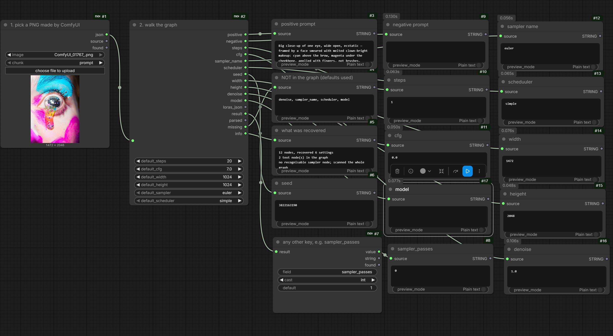
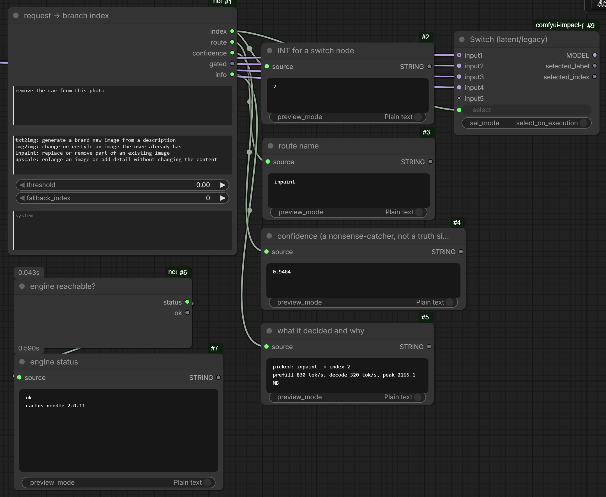

# ComfyUI × Cactus Needle 2

ComfyUI nodes around [**Needle 2**](https://huggingface.co/Cactus-Compute/needle2) — a
45M-parameter model that turns text into JSON. It runs on the **CPU** in a 14 MB binary,
so it costs your GPU nothing: ~0.2–1.5 s per call at 550–840 tok/s prefill.

Plus a set of nodes that read a ComfyUI workflow back out of a PNG. Those use no model
at all.

- **Model:** https://huggingface.co/Cactus-Compute/needle2
- **Upstream engine (Cactus Compute):** https://github.com/cactus-compute/needle
- Architecture paper: [arXiv:2607.18363](https://arxiv.org/abs/2607.18363)

Needle 2 is not a generation model. It does tool calling and structured extraction, and
there is **no free-text fallback** — every answer is structured. In a ComfyUI graph its
value is *control, not generation*: natural language in, typed graph parameters out.

---

## Read a workflow back out of a PNG



Pick an image, walk its embedded graph, get the prompt, seed, size, model and sampler
settings back as real `INT`/`FLOAT`/`STRING` outputs. The `missing` output names
everything that was **not** in the graph, so a default never quietly passes itself off as
a recovered setting — above, `denoise, sampler_name, scheduler, model` were genuinely
absent.

## Route a request to a branch



`"remove the car from this photo"` → `inpaint` → index `2`, wired straight into an
Impact Pack switch. Zero VRAM, ~0.16 s.

---

## Nodes

| Node | Does | Uses the model |
|---|---|---|
| `Needle Extract` | Text → JSON against a schema you define | yes |
| `Needle Get Field` | Pull one field out as a wildcard (`ANY`) output | no |
| `Needle Router` | Classify a request into a branch, gated on confidence | yes |
| `Needle Prompt to Sampler Params` | Prompt → width/height/steps/cfg/sampler/scheduler/seed | yes |
| `Needle Engine Status` | Reports whether the engine can load at all | yes |
| `Workflow From Image` | Pull the `prompt` JSON out of a PNG | no |
| `Workflow Parse` | Graph → prompts, seed, steps, cfg, sampler, model | no |
| `Workflow Texts` | Every text node, for graphs the sampler walk cannot map | no |

**Not** for prompt enhancement, captioning, translation, or chat. Needle 2 is not
multimodal and its context is a 256-token sliding window. Use a real LLM/VLM node for
those.

---

## Install

```
cd ComfyUI/custom_nodes
git clone https://github.com/DenRakEiw/Comfyui_Needle2
python_embeded\python.exe -m pip install cactus-needle
```

> **The directory must not be called `needle`.** That name collides with the engine's own
> Python package. ComfyUI's own loader is fine with it, but any custom node pack that puts
> `custom_nodes` on `sys.path` — `comfyui-vrgamedevgirl` does — makes `import needle` find
> this pack instead of the engine, and every node fails with a clear error telling you to
> rename. `Comfyui_Needle2` is safe.

The wheel is 83 KB and pulls only `huggingface_hub`. On first run the engine downloads
`libneedle.dll` / `.so` / `.dylib` (14 MB) into `~/.cache/cactus-needle/`.

JAX and Flax are needed **only** for finetuning. Do not install the `[train]` extra into
ComfyUI's Python — it upgrades numpy to 2.x and will break torch-based custom nodes.

### Windows: Smart App Control blocks the engine

`libneedle.dll` is unsigned, so Smart App Control or a WDAC policy refuses to load it:

```
OSError: [WinError 4551] An application control policy has blocked this file
```

Check with `Get-MpComputerStatus | Select-Object SmartAppControlState`. The only fix is
turning Smart App Control off in Windows Security → App & browser control, which is
**irreversible** — it cannot be re-enabled without reinstalling Windows. `Needle Engine
Status` reports this condition explicitly instead of failing with a bare ctypes error.

---

## Measured behaviour — read this before trusting it

This is a 45M model. What it does well and badly was measured, not assumed.

- **Extraction from prose is good.** `"Invoice from Acme Corp for 1200.50 dollars, due
  2026-09-01"` → all three fields correct, and off-topic text correctly yields `{}`
  rather than an invented invoice.
- **Routing is decent, not reliable: 4/6** on the built-in routes. Wrong answers came back
  with middling confidence (0.65–0.68) and correct ones sometimes with 0.00 — so the
  confidence gate is a backstop against nonsense input, **not** a correctness signal.
  Leave `threshold` at 0 unless you have measured your own routes.
- **Sampler params work on dense prompts, not sparse ones.** A prompt naming everything
  extracts cleanly. `"a portrait, 40 steps"` returns nothing at all and the node falls
  back to your defaults. Measured 7/11 numeric fields across five prompts; the other four
  were defaults, never wrong values.
- **English only in practice.** German input produced no call at all (confidence 0.48)
  where the English equivalent scored 0.996.

The guarantee these nodes give you is not accuracy — it is that **a miss degrades to your
configured default, never to a made-up number**, and that a sampler outside the list you
offered can never reach KSampler.

### Tried and rejected: a text → BOOLEAN classifier

A "does this text match this statement" node would fit the model's shape perfectly — one
typed value out — but it does not work. Four framings were measured on
`"the text describes a photo of a person"`:

| Framing | Correct | Abstained |
|---|---|---|
| single boolean parameter | 1/6 | 5 |
| enum field `["yes","no"]` | 3/6 | 3 |
| two tools `yes` / `no` | 0/6 | 6 |
| two action tools `keep` / `skip` | 3/6 | 1 (2 outright wrong) |

The best framing, widened to 12 cases, answered only 6 times and got one of those wrong.
Phrasing the criterion as an explicit command — closer to the model's training domain —
made it *worse* (7/8 abstentions). Needle 2 extracts facts that are stated in the text; it
does not make judgements about the text. No such node ships here.

---

## The workflow nodes

ComfyUI only — no A1111 or Forge parsing, and no model: a workflow graph is exact
structured data, walking it is exact too, and a 45M model reading JSON through a
256-token window would be strictly worse.

Measured on **400 real graphs** (0 exceptions), counting only the 129 that contain a
sampler:

| | recovered |
|---|---|
| seed, sampler, model, steps | 129/129 (100%) |
| cfg | 125/129 (96%) |
| width / height | 97/129 (75%) |
| positive prompt | 317/400 of all graphs |

The gaps are the workflows, not the parser. Sigma-driven graphs (`ManualSigmas`) have no
`steps` input at all, so the count is derived from the length of the sigma schedule.
Latent sizes are often computed at runtime via `GetImageSize`, so no literal exists to
read.

Three things make this harder than it looks:

- **The sampler is not `KSampler`.** In the install this was built against,
  `SamplerCustomAdvanced` accounts for 1031 of the sampler nodes and plain `KSampler` for
  51. The walk follows the sampler's own links — guider, sigmas, noise — instead of
  matching a class name.
- **Multi-pass graphs share nodes.** A hires-fix or LTXV-upscale workflow has two samplers
  whose conditioning chains overlap, so "the first sampler in the JSON" mixes settings
  from both passes. `Workflow Parse` walks back from the output node to find the pass that
  actually produced the file, and reports `sampler_passes` when there is more than one.
- **Values hide behind links.** `noise_seed` often points at a `PrimitiveInt` and
  `CLIPTextEncode.text` at a string node, so links are resolved transitively. Node ids are
  strings and may be subgraph-namespaced (`"29:39"`).

When a graph builds its prompt at runtime, `positive` comes back **empty** with a note
rather than handing you an unrelated text node — some of them hold Python snippets.
`Workflow Texts` lists everything so you can pick by hand.

Every key found is also on the `result` output, so `Needle Get Field` reads anything
without its own slot.

---

## The wildcard (`ANY`) outputs

`Needle Get Field` returns `ANY`, so one node feeds an `INT`, a `STRING`, or anything else
depending on the schema. ComfyUI implements this in `comfy_execution/validation.py`:
`validate_node_input` short-circuits when either side is `"*"`, and also honours the older
`__ne__`-override idiom. This pack uses the `AnyType(str)` subclass, which satisfies both.

The cost is that nothing is checked until the receiving node runs — a mistyped field name
surfaces as a runtime error downstream, not as a refused connection in the UI. Use the
`cast` widget to force the type you want.

## Schema shorthand

`Needle Extract` accepts three shapes. The shorthand is usually enough:

```json
{ "vendor": "string", "total": "number", "note": "string?" }
```

A trailing `?` marks a field optional. A bare JSON Schema and a full needle tool schema
also work. Needle omits fields it found no evidence for, so `Needle Get Field` has a
`default` widget and a `found` output.

---

## Examples

Drag any file from `examples/` onto the ComfyUI canvas:

| File | Shows |
|---|---|
| `01_read_workflow_from_png.json` | PNG → graph walk → prompt, seed, steps, and what was **not** in the graph |
| `02_extract_text_to_fields.json` | text → JSON → individual fields through the `ANY` output |
| `03_router_and_status.json` | request → branch index with the confidence gate, plus the engine probe |

They are generated from the node definitions rather than typed by hand, so widget order
cannot drift out of sync, and each one is checked against ComfyUI's own
`execution.validate_prompt`. Example 1 has an image name preselected that will not exist
on your machine — pick one of your own ComfyUI PNGs in the widget.

---

## Implementation notes worth keeping

Not style choices; each one was measured and changes the output.

- **`reset()` before every call.** Agents are cached and the engine keeps a 256-token
  conversation window. Without a reset, one off-topic prompt makes *every later*
  extraction return `{}`.
- **The router declares one tool per route**, not one enum-valued field. Needle is trained
  to select a tool: the enum form scored **0/6**, one-tool-per-route **4/6**.
- **Numeric bounds feed the decoding grammar.** Without `"maximum"` on `cfg`, the model
  reads `"cfg 4.5"` as `45` — its own reasoning says so.
- **Enum fields are declared first.** With them last, `scheduler` came back `None` 0/4;
  declared first, sampler and scheduler are both correct 4/4.
- **`drop_ungrounded`** uses the engine's undocumented `validation.ungrounded` list to
  discard values it could not ground in the input. On `"a car, 768x512, 12 steps"` the
  model returned `600x600` and flagged exactly those fields.
- **The engine is a process-global singleton** with module-level state. Every call goes
  through one lock; 8 concurrent node runs were verified clean.
- **Finetuned `.cact` weights cannot be unloaded.** Once one is loaded, every base-model
  node in the process fails, and confidence becomes `None`.
- **Telemetry is disabled** by default here; re-enable with `NEEDLE_COMFY_TELEMETRY=1`.
- `peak_ram_mb` in the envelope is process-wide, not engine-only.

---

## Credits & license

Needle 2 is built by [Cactus Compute](https://github.com/cactus-compute/needle) and
released under Apache 2.0. This node pack follows suit — see [LICENSE](LICENSE).

All of the model's own capabilities, limits and file formats belong to the upstream
project; this repository only wires it into ComfyUI.
